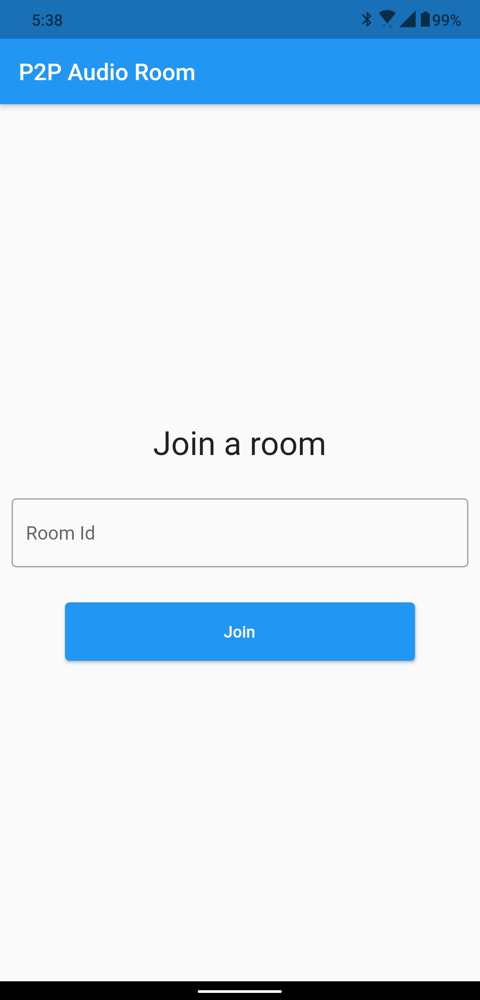

# P2P Audio Room

A simple audio room using peer to peer technology with WebRTC mesh network.

Here I have used:-
 - flutter_webrtc for peer to peer connection.
 - A signalling server running socket.io
 - A public STUN/TURN server

### Screenshots

  

### Drop a ⭐ if you like it!